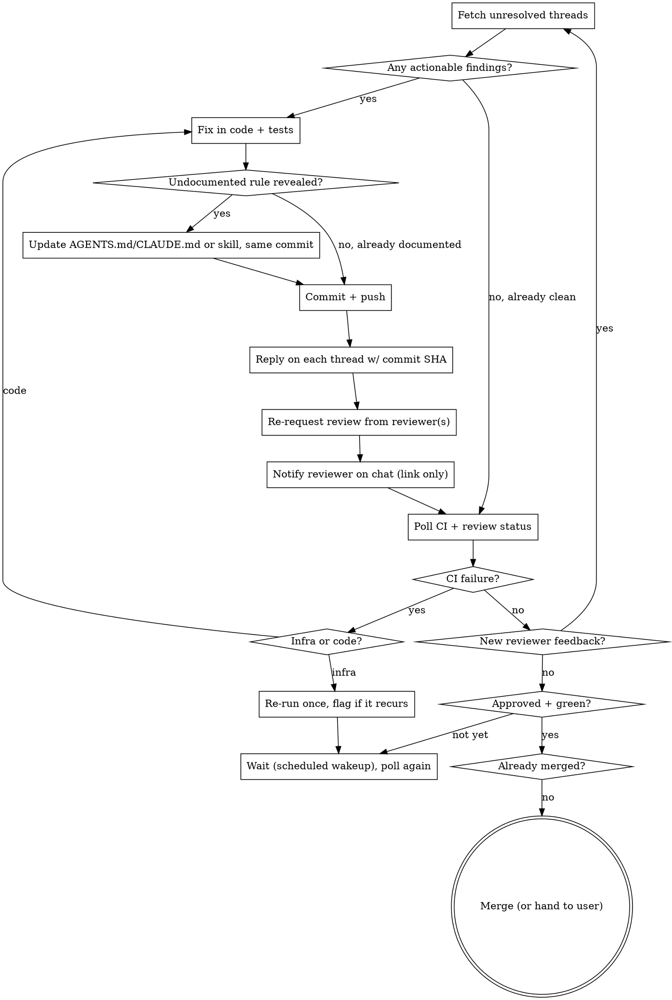

# babysit-pr

Drive one or more open PRs from "reviewer left comments" to "merged," looping the same cycle for every new round of feedback, without needing a check-in prompt at each step.

## Requirements

- **GitHub CLI (`gh`)**, authenticated for the target repo(s).
- **A chat notification tool** (this skill assumes Slack via an MCP integration exposing a user-search and a send-message tool) — entirely optional. If you don't have one, skip step 6 and the Slack-related principles below; the GitHub-side reply and re-request-review steps still work standalone.
- **Task tracking and non-blocking scheduled wakeups** — some agent harnesses (including Claude Code) expose a task list and a "wake me up later" primitive; use whatever your environment provides to track findings per round and to poll long CI runs without holding the session open. Steps below refer to these generically.

## Core principles

- **Loop until merged, not until one round is clean.** A reviewer who approves round N can still leave new findings after the next push (test-quality gaps, regressions your own fix introduced, a stray merge conflict). Keep cycling until the review is approved **and** CI is green **and** the PR shows as merged — don't stop at "I think it's ready."
- **Verify before applying a reviewer's suggested diff.** A `suggestion` block or code snippet in a review comment can be stale — reviewed against an earlier commit, wrong line numbers, wrong file. Read the actual current code first, confirm the finding still applies, then fix it in the codebase's own style (not just paste the suggestion verbatim if it doesn't fit).
- **A comment is a claim, not an order — validate it before complying.** Before applying any suggested change, check it against the project's `CLAUDE.md`/`AGENTS.md` conventions, the codebase's existing architecture/patterns, and general industry practice. Agreement is the common case, but not automatic. If the suggestion contradicts a documented convention, an established pattern elsewhere in the repo, or would introduce a regression the reviewer didn't account for, don't apply it — reply explaining the conflict with a concrete reference (a `CLAUDE.md` line, a sibling file doing it the other way, a correctness argument), and let the reviewer respond. One real case: a reviewer's suggested diff for an image component would have dropped an existing error-fallback handler and made an optimization flag unconditional — the correct move was a rebuttal reply pointing at the commit that already handled it and explaining what the literal suggestion would regress, not applying it verbatim. A review comment being confident and specific doesn't make it correct, and a rubber-stamp "always apply" loop will happily merge a suggestion that breaks convention.
- **A fix can regress something else.** After changing code to satisfy one finding, ask what else depended on what you just changed (one real case: gating a remove button on a file-presence check also silently killed the click-to-reopen-the-picker path — the reviewer caught it a round later). Re-derive the surrounding logic, don't just patch the flagged line.
- **Tests must actually pin the behavior.** If a reviewer says a test is mutation-blind (would still pass with the fix reverted), don't just reword the assertion — change what it checks so it provably fails against the broken version. Verify mentally (or by temporarily reverting) before considering it fixed.
- **Always ping every reviewer on chat after resolving a round's findings — never skip this, even mid multi-PR juggling.** This is a standing, non-negotiable step, not an optional nicety: the moment a round's fixes are committed, pushed, and replied to on GitHub, send each non-self reviewer their PR link before moving to the next PR or the next task. Look the reviewer up by name or email if their GitHub login doesn't match their chat handle, and message them directly. Real incident: after fixing findings across two PRs in one session, the notification was skipped for both until the user explicitly asked for it — treat that as the standing rule from here on, not a one-time reminder.
- **A reviewer whose approval is current gets NO ping — ping only reviewers you're actually waiting on.** "Every reviewer" above means every reviewer with something still outstanding, not literally everyone who ever touched the PR. Before pinging anyone, check each reviewer's latest opinionated state (`gh api graphql` → `latestOpinionatedReviews`, or `gh pr view --json reviews` and take the newest state-carrying review per author):
  - `CHANGES_REQUESTED` still standing → **ping.** This is the blocker; it needs their click to clear.
  - Requested but never reviewed, and their review is required to unblock → **ping.**
  - `APPROVED` at the current HEAD → **do not ping.** There is nothing for them to do. A "your approval is in, nothing needed from you" DM is pure noise in their inbox.
  - `APPROVED` but **stale** (approval sits on an older SHA and new commits have landed since, so it no longer counts toward merge) → ping, because a fresh look genuinely is needed. Distinguish these two cases by comparing the approval's `commit.oid` against `headRefOid` — do not assume a force-push invalidated it, since a rebase that only rewrites SHAs can leave GitHub's approval attached to the new HEAD. Check, don't guess.

  Same filter applies to the reminder cadence below: only reviewers in the ping-worthy set get reminders. Real incident: one reviewer had `APPROVED` at the exact current HEAD and another's stale `CHANGES_REQUESTED` was the sole blocker; the skill pinged both, and the user pushed back — only ping reviewers who actually requested changes or haven't reviewed, not someone whose approval already stands.
- **Chat gets a link plus one short reference line, not a summary.** GitHub inline replies carry the substance; a review bot may already post status updates in the same thread, so a full bullet recap on chat is redundant. But a bare link with zero context also isn't enough — the reviewer has to click through with no idea why they're being pinged again. Send the PR link plus a single short line naming what happened, e.g. `Addressed your review comments — ready for another look.` or `Fixed the findings from your last review.` One line, no bullets, no per-finding recap — that detail lives in the GitHub replies. Message shape: `<one-line reference>\n<PR URL>`.
- **No review after a poll iteration → send a reminder, don't just poll again silently. Fixed cadence: every 15 minutes of no response.** If a full polling iteration passes (a scheduled wakeup fires and you check status) with no new review, no new commits from anyone else, and no state change since the last ping, and **at least 15 minutes have elapsed since that last ping to this reviewer on this PR**, send a follow-up reminder before scheduling the next wait — don't let the loop go quiet for multiple iterations just because there's "nothing new" to report. Keep it to the same one-line-plus-link shape as the original notify (step 6), e.g. `Still waiting on your review when you get a chance.\n<PR URL>`, and **reply into that reviewer+PR's existing thread** (step 6) rather than sending a new top-level message — no need to re-explain what changed, that's already in the first ping. Compute the elapsed time from the last ping's timestamp each time a wakeup fires, and only send when it's ≥15 minutes — this fires at most once per 15-minute window per reviewer per PR, not on every single wakeup back-to-back regardless of interval.
- **Infra failures get flagged, not fixed.** A broken CI runner (missing dependency, corrupted install) is not your diff's problem and not yours to provision — re-run once, and if it recurs identically, post one PR comment explaining the exact error and stop re-running. Don't touch runner/CI infrastructure unless the user explicitly asks for that as a separate task.
- **Don't block synchronously on long CI runs.** A real test suite can run 15–20 minutes or more. Use your environment's scheduled-wakeup mechanism between checks rather than holding the turn open, and don't rely on `gh pr checks --watch` for long jobs — it has been observed to exit with a false failure well before the job actually finishes. Poll directly with `gh pr checks` / `gh pr view --json` instead.
- **Check `state` before merging.** The human may merge it themselves the moment they see it's green. `gh pr view --json state` first; if already `MERGED`, there's nothing to do.
- **Track every round with a task list, not just memory.** The moment unresolved threads are fetched (step 1) and turn out actionable, create one parent task ("Resolve PR #N review comments") plus one subtask per distinct finding (one per thread/CI failure/merge conflict this round), and mark each in-progress/completed as you work it — don't just fix things silently. This keeps a multi-file, multi-PR fix-round auditable (what was found, what was actually changed vs. rebutted) and survives a compaction or handoff mid-round. Re-create the subtask list fresh each new round of feedback — don't carry stale tasks forward across rounds.
- **A finding that reveals an undocumented rule gets written down, not just fixed.** Fixing the flagged line closes this PR; it does nothing for the next one. If a reviewer's comment reveals a convention, forbidden pattern, or architectural rule that isn't already captured in the repo's `AGENTS.md`/`CLAUDE.md` or its skills, add it in the same commit as the code fix (step 3) — see step 2b. Skip this only for genuine one-offs (a typo, a comment specific to this PR's business logic) that no future PR would repeat.

## Setup — ask once per cycle, not every round

At the start of a new babysit-pr run (not on every loop iteration), confirm:

1. **Which PR(s)** — number + repo for each. If unstated and there's exactly one open PR on the current branch, use `gh pr view --json number,url`; otherwise ask.
2. **Merge authority** — should the skill merge automatically once approved+green, or leave the final merge click to the user? Ask if it's ambiguous or the PRs are high-stakes (migrations, auth, money).
3. **Reviewer's chat channel/handle** — search for an existing thread with the reviewer before assuming one doesn't exist; reuse it rather than starting a new conversation.
4. **Per-reviewer opt-outs** — if the user says a given reviewer should be GitHub-only (never messaged), skip step 6 entirely for that person for the rest of this run: the request-review API call is their complete notify action. Treat this as a per-run instruction, not a standing rule — don't carry it into future runs or extend it to other reviewers without being told again.

Don't re-ask these on every iteration of the loop — carry them for the rest of the run.

## The cycle



## Steps in detail

### 1. Fetch unresolved review threads

Per PR, pull unresolved threads (not just top-level review comments — inline threads carry the actual findings):

```bash
gh api graphql -f query='
query {
  repository(owner: "OWNER", name: "REPO") {
    pullRequest(number: N) {
      reviewThreads(first: 50) {
        nodes {
          isResolved
          path
          line
          comments(first: 10) { nodes { author { login } body createdAt } }
        }
      }
    }
  }
}'
```

Filter to `isResolved: false` threads whose *last* comment is from the reviewer (not your own prior reply) — those are the ones needing action this round.

As soon as this filtered list is non-empty, create the task list before writing any fix: one parent task ("Resolve PR #N review comments") and one subtask per thread/finding, per the core principle above. This is the checkpoint for the whole round — do it here, not after the fixes are already made.

### 2. Validate, then fix — verify, test

Before writing any code, check each finding against:

- **The project's own `CLAUDE.md`/`AGENTS.md`** — a suggestion that contradicts a documented rule (naming, file placement, "never do X", a forbidden-pattern table) loses to the doc, not the comment.
- **Architecture/patterns already in the repo** — grep for how the same problem is solved elsewhere (a sibling component, a similar endpoint). A suggestion that introduces a one-off pattern where a shared one already exists should be pushed back on, or adapted to use the shared one instead.
- **General correctness/industry practice** — does the suggested fix actually close the gap, or does it look plausible but miss the real mechanism (e.g. fixes the symptom on one call site but not the others, or a security fix that's easy to bypass a different way)?

If it holds up: read the actual current file at the flagged path/line before touching anything (line numbers drift as the PR grows), then apply the fix matching the codebase's existing conventions — not a verbatim paste of the suggestion if it doesn't fit. If the finding is about a test, make the new assertion provably catch the regression it's meant to catch. If the finding is about a schema/prop signature change, grep for all call sites before changing it.

If it doesn't hold up: don't apply it. Go straight to the GitHub reply with the rebuttal (step 4) instead of committing anything for that finding, citing the specific convention/pattern/correctness argument it conflicts with.

### 2a. Look past the flagged comments too

The review thread is the minimum, not the whole job. While in the diff, also watch for:

- **CI failures the reviewer hasn't commented on** — a red check is a finding whether or not anyone left a review comment about it. Diagnose it (step 7) in the same pass.
- **Adjacent problems your own fix creates or exposes** — see the regression principle above; re-check anything that reads from or calls what you just changed.
- **Merge conflicts against the base branch** — if `mergeable` flips to `CONFLICTING` between rounds (someone else merged in the meantime), resolve it as part of this same cycle rather than waiting to be asked; use `git merge-tree` to see what's a real conflict before merging blind.

### 2b. Capture the lesson, not just the fix

For each finding actually fixed (not rebutted) in step 2, ask: **would a future PR in this repo make the same mistake, because nothing written down says not to?** If yes, that's a durable rule, not a one-off — update the repo's own docs in the same commit as the code fix:

- **A convention or forbidden pattern** (a `never do X, do Y instead` shape) → add a row to the `Deprecated / Forbidden Patterns` table in `AGENTS.md`/`CLAUDE.md` if one exists, or a new bullet under the closest existing rule section.
- **Mechanics specific to one area** (how a module's caching/auth/styling works) → add it to the matching skill under `.claude/skills/` instead, so it loads only when that area is touched again — don't bloat the always-loaded file with narrow-trigger detail. Most repos' `AGENTS.md` documents this split explicitly (often under a "Self-Maintenance" heading); follow it if present.
- **Genuinely one-off** (a typo, business logic specific to this PR, something no sibling file could repeat) → skip; not everything needs a rule.

This is the same judgment call `AGENTS.md`'s own self-maintenance instructions ask for when editing any file — this step just makes sure a reviewer's finding triggers it too, not only something noticed while reading code. If the repo has no `AGENTS.md`/`CLAUDE.md` or skills directory at all, skip this step silently rather than inventing one mid-review-cycle.

### 3. Commit + push

One commit per fix-round is fine; message should explain *why* (the bug/gap), not restate the diff — this includes any doc/skill update from step 2b, which travels in the same commit as the code fix it documents. Let pre-commit hooks (lint-staged, gitleaks, etc.) run — don't skip them.

### 4. Reply on GitHub

For each addressed comment, reply in its thread referencing the commit SHA:

```bash
gh api repos/OWNER/REPO/pulls/N/comments \
  -f body="Fixed in \`<sha>\`. <one or two sentences on what changed and why>." \
  -F in_reply_to=<comment_id>
```

For a finding you're **not** applying (failed the validation in step 2), reply instead with the specific reason — name the convention, file, or mechanism it conflicts with, and what would break if the suggestion were applied verbatim. Don't just say "disagree" — show the evidence, the way you'd want a human author to justify pushing back:

```bash
gh api repos/OWNER/REPO/pulls/N/comments \
  -f body="Not applying this one — <specific conflict>, e.g. \`AGENTS.md\` says <rule>, or \`<sibling-file>\` already handles this via <pattern>, and the suggested change would <concrete regression>. Happy to revisit if I'm missing context." \
  -F in_reply_to=<comment_id>
```

Get `in_reply_to` comment IDs via `gh api repos/OWNER/REPO/pulls/N/comments --jq '.[] | select(.user.login=="REVIEWER") | "\(.id)\t\(.path)"'`.

### 5. Re-request review

Every round that pushes a fix must explicitly re-request review from whoever left `CHANGES_REQUESTED` — a reply on a thread does not do this automatically, and a reviewer waiting on a GitHub notification won't get one otherwise:

```bash
gh api repos/OWNER/REPO/pulls/N/requested_reviewers -X POST -f 'reviewers[]=REVIEWER_LOGIN'
```

Do this for every reviewer who requested changes this round, not just the one whose comment you addressed — if two people left findings, re-request both.

This also applies to **newly added** reviewers, not just re-requested ones: adding someone to a PR who wasn't there before is a request-review action just like the round-trip case, and it must always be followed by the same notify step (step 6) — a bare API add with no notification is an incomplete application of this skill's own notify rule.

### 6. Notify on chat — one thread per reviewer per PR, never a new top-level message each time

**First, filter the recipient list** (see the "approval is current gets NO ping" principle above): drop anyone whose `APPROVED` sits on the current `headRefOid`. Ping only reviewers with a standing `CHANGES_REQUESTED`, a stale approval on an older SHA, or a required-but-never-submitted review. If that filter leaves nobody, send nothing — a round can legitimately end with zero messages.

The **first** ping to a given reviewer for a given PR is a new top-level message:

```
send_message(recipient=<reviewer>, message="Addressed your review comments — ready for another look.\n<PR URL>")
```

**Immediately record the returned thread/message id** as that reviewer+PR's thread — keep it in your working state/task notes for the rest of the run. Every subsequent contact with that same reviewer about that same PR — a re-request-after-fix ping, a stale-review reminder, a CI-status update, anything — replies into that thread instead of sending a new standalone message:

```
send_message(recipient=<reviewer>, thread=<recorded thread id>, message="Fixed the findings from your last review.\n<PR URL>")
```

This keeps one message thread per reviewer per PR instead of a scattering of unthreaded messages cluttering their inbox with duplicate-looking pings. Only start a **new** top-level message (and record a new thread id) when: this is genuinely the first contact with this reviewer about this PR, or the PR itself changed (a different PR number needs its own thread, never reuse one PR's thread for another). If the run is resumed after a compaction/handoff and the thread id was lost, it's fine to search recent history or just start a fresh top-level message rather than guessing a thread id — don't invent one.

Look up the reviewer with whatever your chat integration provides — their GitHub login rarely matches their chat display name, so search by name fragments or email.

One short reference line + the link — not a bullet recap. The line just tells the reviewer *why* they're being pinged again (their findings were addressed); the actual per-finding detail lives in the GitHub replies from step 4. Send this **every round a fix went out**, not just the first — the re-request on GitHub and the chat ping are the two "please look again" signals and both go out together, every time. Skip only the PR's own author if they left review comments under their own account (GitHub also blocks re-requesting review from the author).

### 7. Poll, don't watch-block

```bash
gh pr checks N --repo OWNER/REPO
gh pr view N --repo OWNER/REPO --json reviewDecision,mergeStateStatus,mergeable,state
```

If a check is still running and likely to take a while, schedule a wakeup (10–15 min, shorter if a result seems imminent) instead of blocking. Re-invoke this same skill/prompt on wake.

### 8. Handle CI failures

- **Infra-flavored** (self-hosted runner missing a binary/dependency, a transient 5xx on a metadata-update step, a `waitFor` timeout): `gh run rerun <run-id> --failed` once. If it fails identically (same runner name, same error) on the retry, it's not transient — post one `gh pr comment` explaining the exact log line and why it's not the diff, then stop re-running.
- **Code-flavored**: treat as a new finding — loop back to step 2.
- Never attempt to actually fix the runner/CI infrastructure as part of this skill — that's separate work requiring its own authorization.

### 9. Loop or merge

- New `CHANGES_REQUESTED` review or new unresolved threads → back to step 1.
- `reviewDecision: APPROVED` + all checks green (accepting a documented infra-only exception) → check `state` first; if not already `MERGED`, merge (`gh pr merge N --repo OWNER/REPO --squash`, or whatever the repo's convention is) unless the setup step said to leave merging to the user.
- Repeat for every PR in the set — they don't have to finish at the same time.

### 10. Reporting status to the user

Whenever reporting on more than one PR at once — a mid-run status check-in or the final "all merged" wrap-up — use a markdown table, one row per PR, with the PR reference as a clickable markdown link (not a bare URL): `[#<number> — <title>](<url>)` | status (e.g. `Merged`, `Awaiting re-review`, `CI running`) | round count or elapsed time. For a single PR, a plain sentence with a linked reference is fine — the table is for when there's more than one to scan at a glance.

## Related

- A PR-review skill covering the reviewer side of this loop (posting the review this skill responds to) pairs well with this one, if you have one.
- Basic commit/PR-creation skills — for work that hasn't reached "PR open with feedback" yet.
- A generic `loop` skill or scheduler — if you want this run on a fixed interval rather than event-driven wakeups.
